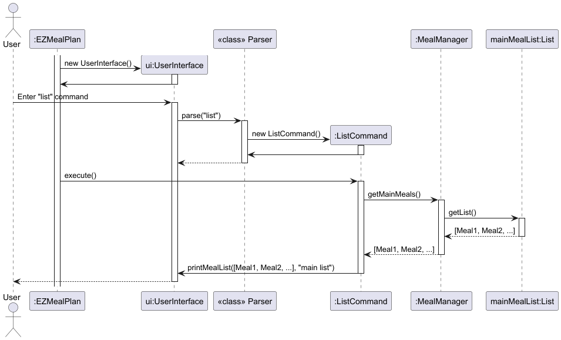

# Developer Guide

## Acknowledgements

{list here sources of all reused/adapted ideas, code, documentation, and third-party libraries -- include links to the original source as well}

## Design & implementation

{Describe the design and implementation of the product. Use UML diagrams and short code snippets where applicable.}

This sequence diagram shows the processes that EZMealPlan system has to undergo while it is being booted up before it is ready for usage.


This sequence diagram shows the general flow of how the EZMealPlan system process the respective command inputted by the user. Many relevant details and classes have been omitted for the purpose of simplicity. The implementations for the respective commands will be explained in greater details and illustrated with UML diagrams later.

### Enhancements in the Command Module

Both commands extend the abstract Command class, thereby following our command design pattern to decouple user input parsing from the actual execution of features. 
The primary objective of these commands is to ensure a clear separation of concerns, improve maintainability, and allow for easier testing.

#### 1. MealCommand

##### 1.1 Design Overview

###### Function
MealCommand is responsible for fetching the user meals from the MealManager and displaying them via the UserInterface.

###### Design Goals

**Single Responsibility:**
- MealCommand only deals with retrieving the user-selected meal list and forwarding it to the UI.

**Decoupling:**
- By isolating the command logic from both the UI and data management, future changes in either will have minimal impact.

**Testability:**
- The design allows for easy unit testing by injecting a test-specific UI that captures the output.

##### 1.2 Implementation Details

###### Component Level: MealCommand Class

- Inherits from the abstract Command class
- Implements the `execute(MealManager mealManager, UserInterface ui)` method
- Uses logging (via `logger.fine`) to trace execution
- Retrieves the user meal list using `mealManager.getUserMeals().getList()`
- Passes the list to the UI's `printMealList` method with the label "user chosen meals"

###### Code Example
```java
@Override
public void execute(MealManager mealManager, UserInterface ui) throws EZMealPlanException {
    logger.fine("Executing MealCommand");
    List<Meal> userMealList = mealManager.getUserMeals().getList();
    ui.printMealList(userMealList, "user chosen meals");
}
```

##### 1.3 Sequence Diagram


##### 1.4 Unit Testing

###### Testing Approach
- A test-specific subclass of UserInterface (named TestUserInterface) is defined to capture the parameters passed to the `printMealList` method
- The unit test populates the MealManager's user meals list with sample meals
- Executes MealCommand
- Asserts that the UI received the expected label and list of meals

###### Unit Test Code
```java
@Test
public void testExecute_mealCommand_printsUserChosenMeals() throws EZMealPlanException {

    MealManager mealManager = new MealManager();
    Meal meal1 = new Meal("Meal A");
    Meal meal2 = new Meal("Meal B");
    mealManager.getUserMeals().getList().add(meal1);
    mealManager.getUserMeals().getList().add(meal2);

    TestUserInterface testUI = new TestUserInterface();
    MealCommand mealCommand = new MealCommand();
    mealCommand.execute(mealManager, testUI);

    assertEquals("user chosen meals", testUI.capturedListName);
    List<Meal> expectedMeals = new ArrayList<>();
    expectedMeals.add(meal1);
    expectedMeals.add(meal2);
    assertIterableEquals(expectedMeals, testUI.capturedMeals);
}
```

#### 2. ListCommand

##### 2.1 Design Overview

###### Function
ListCommand fetches the main meal list from the MealManager and instructs the UI to display it.

###### Design Goals

**Single Responsibility:**
- ListCommand solely handles the retrieval and display of the main meals.

**Decoupling:**
- By segregating responsibilities, it makes the code easier to maintain and extend.

**Testability:**
- The design supports unit testing by allowing a test-specific UI to capture and verify the output.

##### 2.2 Implementation Details

###### Component Level: ListCommand Class

- Inherits from the abstract Command class
- Implements the `execute(MealManager mealManager, UserInterface ui)` method
- Uses logging to indicate execution
- Retrieves the main meal list using `mealManager.getMainMeals().getList()`
- Calls `ui.printMealList` with the label "main list"

###### Code Example
```java
@Override
public void execute(MealManager mealManager, UserInterface ui) throws EZMealPlanException {
    logger.fine("Executing 'list' command");
    List<Meal> mainMealList = mealManager.getMainMeals().getList();
    ui.printMealList(mainMealList, "main list");
}
```

##### 2.3 Sequence Diagram



##### 2.4 Unit Testing

###### Testing Approach
- Uses a test-specific TestUserInterface subclass to capture the output of `printMealList`
- Sets up the main meal list in the MealManager
- Executes ListCommand
- Verifies that the UI output matches the expected label and meal list

###### Unit Test Code
```java
@Test
public void testExecute_listCommand_printsMainList() throws EZMealPlanException {

    MealManager mealManager = new MealManager();
    Meal meal1 = new Meal("Main Meal 1");
    Meal meal2 = new Meal("Main Meal 2");
    mealManager.getMainMeals().getList().add(meal1);
    mealManager.getMainMeals().getList().add(meal2);

    TestUserInterface testUI = new TestUserInterface();
    ListCommand listCommand = new ListCommand();
    listCommand.execute(mealManager, testUI);

    assertEquals("main list", testUI.capturedListName);
    List<Meal> expectedMeals = new ArrayList<>();
    expectedMeals.add(meal1);
    expectedMeals.add(meal2);
    assertIterableEquals(expectedMeals, testUI.capturedMeals);
}
```

## Product scope
### Target user profile

{Describe the target user profile}

### Value proposition

{Describe the value proposition: what problem does it solve?}

## User Stories

|Version| As a ... | I want to ... | So that I can ...|
|--------|----------|---------------|------------------|
|v1.0|new user|see usage instructions|refer to them when I forget how to use the application|
|v2.0|user|find a to-do item by name|locate a to-do without having to go through the entire list|

## Non-Functional Requirements

{Give non-functional requirements}

## Glossary

* *glossary item* - Definition

## Instructions for manual testing

{Give instructions on how to do a manual product testing e.g., how to load sample data to be used for testing}
