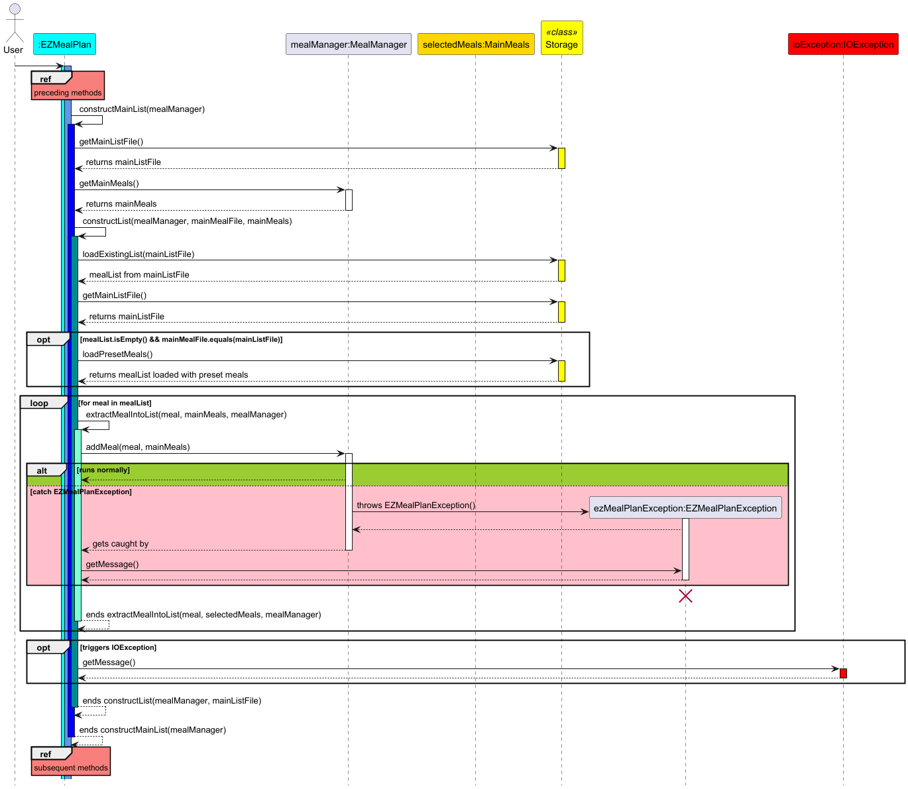

# Developer Guide

## Acknowledgements

{list here sources of all reused/adapted ideas, code, documentation, and third-party libraries -- include links to the original source as well}

## Design

EZMealPlan follows a modular and object-oriented design centered around a command-based architecture.

### Architecture Overview

- **Parser**: Interprets user input and delegates to appropriate command classes.
- **Command classes**: Each command is encapsulated in its own class (e.g., `ListCommand`, `FilterCommand`, `SelectCommand`) that implements an `execute()` method.
- **MealList and UserMealList**: Encapsulate meal storage and operations, such as adding, removing, and viewing meals.
- **Meal and Ingredient**: Core data classes representing recipes and their components.
- **Storage**: Handles saving and loading from `main_meal_list.txt` and `user_meal_list.txt`.

### Logging

- Global logger is initialized in the `EZMealPlan` class.

- Functional classes use `logger.WARNING` for exceptions and `logger.SEVERE` for assertions.

- JUnit test classes use their own logger with `logger.INFO` for exceptions.

## Input Handling

- All user inputs are case-sensitive and normalised to lowercase.


This sequence diagram shows the processes that EZMealPlan system has to undergo while it is being booted up before it is ready for usage.


This sequence diagram shows the procedures of extracting meals from the "mainMealFile" (mainList.txt). The procedures of extracting meals from the "userMealFile" (userList.txt) can be depicted simply by replacing "mainMealFile" with "userMealFile", storage.getMainListFile() with storage.getUserListFile(), mealManager.getMainMeals() with mealManager.getUserMeals() and lastly, "mainMeals" of MainMeals class with "userMeals" of UserMeals class.


This sequence diagram shows the general flow of how the EZMealPlan system process the respective command inputted by the user. Many relevant details and classes have been omitted for the purpose of simplicity. The implementations for the respective commands will be explained in greater details and illustrated with UML diagrams later.

### Food Package

The food package contains the abstract class `Product`, as well as `Ingredient` and `Meal` classes.


The `Ingredient` class,
* Represents an ingredient, which has a `name` and `price`
* Contains the `setPrice` method, as well as private methods to check that 
the price provided is non-negative and able to be parsed as a `Double`

The `Meal` class,
* Represents a meal, which has a `name`, `price`, and `ingredientList` of type `List<Ingredient>`.
* Contains the `addIngredient` method that adds an `Ingredient` into its `ingredientList`. While doing so, it
also retrieves and adds the `price` of the `Ingredient` into the meal's `price`.
* Contains a private method that checks if an `Ingredient` to be added is already duplicated in the `ingredienList`, and
throws an exception.

### Enhancements in the Command Module

Both commands extend the abstract Command class, thereby following our command design pattern to decouple user input parsing from the actual execution of features. 
The primary objective of these commands is to ensure a clear separation of concerns, improve maintainability, and allow for easier testing.

#### 1. RecipesCommand

##### 1.1 Design Overview

###### Function
MealCommand is responsible for fetching the user meals from the MealManager and displaying them via the UserInterface.

###### Design Goals

**Single Responsibility:**
- RecipesCommand only deals with retrieving the user-selected meal list and forwarding it to the UI.

**Decoupling:**
- By isolating the command logic from both the UI and data management, future changes in either will have minimal impact.

**Testability:**
- The design allows for easy unit testing by injecting a test-specific UI that captures the output.

##### 1.2 Implementation Details

###### Component Level: RecipesCommand Class

- Inherits from the abstract Command class
- Implements the `execute(MealManager mealManager, UserInterface ui)` method
- Uses logging (via `logger.fine`) to trace execution
- Retrieves the user meal list using `mealManager.getUserMeals().getList()`
- Passes the list to the UI's `printMealList` method with the label "user chosen meals"

###### Code Example
```java
public void execute(MealManager mealManager, UserInterface ui) throws EZMealPlanException {
    assert mealManager != null : "MealManager cannot be null";
    logger.fine("Executing 'recipes' command");
    String recipesListName = mealManager.getRecipesList().getMealListName();
    List<Meal> recipesList = mealManager.getRecipesList().getList();
    ui.printMealList(recipesList, recipesListName);
}
```

##### 1.3 Sequence Diagram


##### 1.4 Unit Testing

###### Testing Approach
- A test-specific subclass of UserInterface (named TestUserInterface) is defined to capture the parameters passed to the `printMealList` method
- The unit test populates the MealManager's user meals list with sample meals
- Executes RecipesCommand
- Asserts that the UI received the expected label and list of meals

###### Unit Test Code
```java
@Test
public void testExecute_recipesCommand_printsRecipesList() throws EZMealPlanException {
    logger.fine("Running testExecute_recipesCommand_printsRecipesList()");
    MealManager mealManager = new MealManager();
    Meal meal1 = new Meal("Main Meal 1");
    Meal meal2 = new Meal("Main Meal 2");
    mealManager.getRecipesList().getList().add(meal1);
    mealManager.getRecipesList().getList().add(meal2);

    TestUserInterface testUI = new TestUserInterface();
    RecipesCommand recipesCommand = new RecipesCommand();
    recipesCommand.execute(mealManager, testUI);

    assertEquals(mealManager.getRecipesList().getMealListName(), testUI.capturedListName);
    List<Meal> expectedMeals = new ArrayList<>();
    expectedMeals.add(meal1);
    expectedMeals.add(meal2);
    assertIterableEquals(expectedMeals, testUI.capturedMeals);
    logger.info("testExecute_recipesCommand_printsRecipesList() passed");
}
```

#### 2. WishlistCommand

##### 2.1 Design Overview

###### Function
WishlistCommand fetches the main meal list from the MealManager and instructs the UI to display it.

###### Design Goals

**Single Responsibility:**
- WishlistCommand solely handles the retrieval and display of the main meals.

**Decoupling:**
- By segregating responsibilities, it makes the code easier to maintain and extend.

**Testability:**
- The design supports unit testing by allowing a test-specific UI to capture and verify the output.

##### 2.2 Implementation Details

###### Component Level: WishlistCommand Class

- Inherits from the abstract Command class
- Implements the `execute(MealManager mealManager, UserInterface ui)` method
- Uses logging to indicate execution
- Retrieves the main meal list using `mealManager.getMainMeals().getList()`
- Calls `ui.printMealList` with the label "main list"

###### Code Example
```java
public void execute(MealManager mealManager, UserInterface ui) throws EZMealPlanException {
    assert mealManager != null : "MealManager cannot be null";
    logger.fine("Executing 'wishlist' Command");
    List<Meal> wishList = mealManager.getWishList().getList();
    String wishListName = mealManager.getWishList().getMealListName();
    ui.printMealList(wishList, wishListName);
}
```

##### 2.3 Sequence Diagram


##### 2.4 Unit Testing

###### Testing Approach
- Uses a test-specific TestUserInterface subclass to capture the output of `printMealList`
- Sets up the main meal list in the MealManager
- Executes WishlistCommand
- Verifies that the UI output matches the expected label and meal list

###### Unit Test Code
```java
@Test
public void testExecute_wishlistCommand_printsUserChosenMeals() throws EZMealPlanException {
    logger.fine("running testExecute_wishlistCommand_printsUserChosenMeals()");
    MealManager mealManager = new MealManager();
    Meal meal1 = new Meal("Meal A");
    Meal meal2 = new Meal("Meal B");
    mealManager.getWishList().getList().add(meal1);
    mealManager.getWishList().getList().add(meal2);

    TestUserInterface testUI = new TestUserInterface();
    WishlistCommand wishlistCommand = new WishlistCommand();
    wishlistCommand.execute(mealManager, testUI);

    assertEquals(mealManager.getWishList().getMealListName(), testUI.capturedListName);
    List<Meal> expectedMeals = new ArrayList<>();
    expectedMeals.add(meal1);
    expectedMeals.add(meal2);
    assertIterableEquals(expectedMeals, testUI.capturedMeals);
    logger.fine("testExecute_wishlistCommand_printsUserChosenMeals() passed");
}
```

#### 3. SelectCommand

##### 3.1 Design Overview

###### Function
SelectCommand allows the user to select a recipe from the filtered list (obtained via the FilterCommand) by providing its index, and then adds the selected recipe into the user's wish list.

###### Design Goals
- **Single Responsibility:**
    - SelectCommand is solely responsible for validating the user-provided index, retrieving the corresponding recipe from the filtered list, and adding that recipe to the wish list.

- **Decoupling:**
    - By isolating the selection logic from other commands, it becomes easier to maintain and extend without affecting other parts of the system.

- **Testability:**
    - The design supports unit testing by using a test-specific ByeCommandTest to check for the matching

##### 3.2 Implementation Details

###### Component Level: SelectCommand Class
- Inherits from the abstract FilterSelectCommand class.
- Implements the execute(MealManager mealManager, UserInterface ui) method.
- Uses logging to indicate execution and to record any input validation issues.
- Validates the user input index using helper methods (getIndexSubstring, checkValidParse, and checkValidInputIndex).
- Retrieves the filtered meal list via the inherited method getFilteredMealList(mealManager).
- Retrieves the wish list from the MealManager.
- Adds the selected recipe to the wish list and calls ui.printAddMealMessage to display a confirmation message.

###### Code Example
```java
    public void execute(MealManager mealManager, UserInterface ui) throws EZMealPlanException {
        boolean isValidUserInput = checkValidUserInput(filterOrSelect);
        if (!isValidUserInput) {
            logger.severe("Huge issue detected! The user input format remains invalid despite " +
                    "passing all the checks for input formatting error.");
        }
        assert isValidUserInput;
        List<Meal> filteredMealList = getFilteredMealList(mealManager);
        if (filteredMealList.isEmpty()) {
            System.out.println("The filtered meal list is empty.");
            return;
        }
        String indexSubstring = getIndexSubstring();
        int inputIndex = checkValidParse(indexSubstring);
        Meal selectedMeal = checkValidInputIndex(inputIndex, filteredMealList);
        MealList wishList = mealManager.getWishList();
        mealManager.addMeal(selectedMeal, wishList);
        ui.printAddMealMessage(selectedMeal, wishList);
    }
```

##### 3.3 Sequence Diagram
Below is the UML sequence diagram for the SelectCommand, illustrating its interactions with the system components:


##### 3.4 Unit Testing

###### Testing Approach
- Tests are divided into success and failure scenarios using separate test methods
- A custom logger is set up to track test execution with both console and file handlers
- For successful selection tests:
    - Tests run on both empty and populated meal lists
    - Multiple selection command formats are tested (/mname, /ing, /mcost)
- For failure scenarios, tests verify appropriate exceptions are thrown for:
    - Invalid index formats (non-numeric values)
    - Out-of-range indices (negative, zero, or beyond list size)
    - Invalid price formats and negative prices
    - Duplicate meal selections (attempting to add the same meal twice)
- The test utilizes preset meals loaded from Storage to populate the meal list
- Each test verifies expected exception messages match actual exception messages
- 
###### Unit Test Code
```java
@Test
public void selectCommand_success() {
    mealManager.getRecipesList().getList().clear();
    mealManager.getWishList().getList().clear();
    logger.fine("running selectCommand_success()");
    String[] validSelectCommands = {"select 2 /mname a", "select 1 /ing b,c", "select 2 /mcost 2"
            , "select 4 /mname Mname", "select 2 /ing Ing", "select 1 /mcost 5"};
    runValidSelectCommands(validSelectCommands);
    addMeals();
    runValidSelectCommands(validSelectCommands);
    logger.info("selectCommand_success() passed");
}

@Test
public void selectCommand_fail() {
    logger.fine("running selectCommand_fail()");
    mealManager.getRecipesList().getList().clear();
    mealManager.getWishList().getList().clear();
    addMeals();
    checkInvalidPrice();
    checkSelectDuplicateMeal();
    checkInvalidSelectIndex();
    checkIndexOutOfRange();
    logger.info("selectCommand_fail() passed");
}
```
#### 4. ByeCommand

##### 4.1 Design Overview

###### Function
ByeCommand saves the meals from recipesList and wishList into "recipesList.txt" and "wishList.txt" as well as the ingredients from inventory into "inventory.txt" before exiting the program.

###### Design Goals
- **Single Responsibility:**
  - ByeCommand is solely responsible for saving the meals and ingredients into the respective .txt files before shutting down.

- **Decoupling:**
  - By isolating the selection logic from other commands, it becomes easier to maintain and extend without affecting other parts of the system.

- **Testability:**
  - The design supports unit testing by using a test-specific class to 

##### 4.2 Implementation Details

###### Component Level: ByeCommand Class
- Implements the execute(MealManager mealManager, UserInterface ui) method.
- Uses logging to indicate execution and to record any input validation issues.
- Interacts with the MealManager and the Inventory class to retrieve the recipesList, wishList and ingredients respectively.
- Interacts with the Storage Class to write the meals from both recipesList and wishList and to write the ingredients from inventory list into the .txt files recipesList.txt, wishList.txt and inventory.txt respectively. 
- User interface prints goodbye message before it outputs the isExit = `true` to break out of the `while` loop for EZMealPlan.
###### Code Example
```java
   @Override
public void execute(MealManager mealManager, UserInterface ui) {
  updateRecipesListFile(mealManager,ui);
  updateWishListFile(mealManager, ui);
  updateInventoryFile(mealManager, ui);
  ui.printGoodbye();
}
```

##### 3.3 Sequence Diagram


##### 3.4 Unit Testing
```java
@Test
public void byeCommandTest_success() {
  logger.fine("running byeCommandTest_success()");
  try {
    Storage.createListFiles();
    List<Meal> mealsList = Storage.loadPresetMeals();
    Storage.loadExistingInventory(mealManager);
    List<Meal> expectedRecipesList = getExpectedRecipesList(mealsList);
    List<Meal> expectedWishList = getExpectedWishList(mealsList);
    List<Ingredient> expectedInventoryList = getExpectedInventoryList();
    List<File> latestFiles = saveLatestLists();
    expectedGoodByeMessage_success();
    compareFileAndExpectedLists_success(expectedRecipesList, expectedWishList,
            expectedInventoryList,latestFiles);
    logger.info("byeCommandTest_success() passed");
  } catch (Exception exception) {
    ui.printErrorMessage(exception);
    logger.severe("byeCommandTest_success() should not fail");
    fail();
  }
}
```
###### Testing Approach
- Tests are divided into success and failure scenarios using separate test methods
- A custom logger is set up to track test execution with both console and file handlers
- For successful selection tests:
  - Tests run on both empty and populated meal lists
  - Multiple selection command formats are tested (/mname, /ing, /mcost)
- For failure scenarios, tests verify appropriate exceptions are thrown for:
  - Invalid index formats (non-numeric values)
  - Out-of-range indices (negative, zero, or beyond list size)
  - Invalid price formats and negative prices
  - Duplicate meal selections (attempting to add the same meal twice)
- The test utilizes preset meals loaded from Storage to populate the meal list
- Each test verifies expected exception messages match actual exception messages
-
###### Unit Test Code
```java
@Test
public void selectCommand_success() {
    mealManager.getRecipesList().getList().clear();
    mealManager.getWishList().getList().clear();
    logger.fine("running selectCommand_success()");
    String[] validSelectCommands = {"select 2 /mname a", "select 1 /ing b,c", "select 2 /mcost 2"
            , "select 4 /mname Mname", "select 2 /ing Ing", "select 1 /mcost 5"};
    runValidSelectCommands(validSelectCommands);
    addMeals();
    runValidSelectCommands(validSelectCommands);
    logger.info("selectCommand_success() passed");
}

@Test
public void selectCommand_fail() {
    logger.fine("running selectCommand_fail()");
    mealManager.getRecipesList().getList().clear();
    mealManager.getWishList().getList().clear();
    addMeals();
    checkInvalidPrice();
    checkSelectDuplicateMeal();
    checkInvalidSelectIndex();
    checkIndexOutOfRange();
    logger.info("selectCommand_fail() passed");
}
```
## Implementation


## Appendices


### Appendix A: Product scope


#### Target user profile

- **Health-conscious** users who **track food intake** and **prefer meal transparency**.

- **Budget-conscious** users who want to **manage cost-per-meal**.

- **Lazy or busy** users looking for **quick, filtered suggestions**.

- **Home cooks** who want to **create** and **store their own recipes**.

- Users who want a **lightweight, offline meal planning CLI** app.

#### Value proposition

EZMealPlan provides a **simple, command-line interface** for **selecting and managing meals**, **filtering by cost or ingredients**, and **building personalized meal plans**. It solves the problem of:

- **Searching manually** for affordable, relevant recipes
- **Remembering** preferred meals or dietary patterns
3- **Planning meals** within budget constraints

### Appendix B: User Stories

| Version | As a ...                 | I want to ...                                                                                           | So that I can ...                                                             |
|---------|--------------------------|---------------------------------------------------------------------------------------------------------|-------------------------------------------------------------------------------|
| v1.0    | Health-conscious user    | Add my desired calorie intake per day                                                                   | Track my actual intake against that to see how close I am                     |
| v1.0    | Lazy user                | Search for existing recipes by ingredients                                                              | See what is the easiest item I can prepare                                    |
| v1.0    | User                     | Add recipes I come across online                                                                        | View all recipes available in one place                                       | 
| v1.0    | Health-conscious user    | View a graph or figure of my calorie intake over time                                                   | Track my progress towards my goal                                             |
| v1.0    | Indecisive user          | Get recommended recipes                                                                                 | Have a better idea of what to eat                                             | 
| v1.0    | User                     | Get recipe suggestions based on the ingredients available in the supermarket                            | Know which ingredients to purchase                                            |
| v1.0    | Organised user           | Get recipe suggestions that complement the ingredients I have                                           | Use up most of the ingredients I have have left before buying new ingredients |
| v1.0    | Picky-eater user         | Mark ingredients or recipes that I dislike                                                              | Avoid them                                                                    | 
| v1.0    | Picky-eater user         | Mark my favourite ingredients or recipes                                                                | Receive recommendations that match my preferences                             | 
| v1.0    | Careless user            | Backtrack and change my input preferences before confirmation for recipe recommendations                | Get the right recommended recipes                                             | 
| v1.0    | Creative user that cooks | Add and save personal recipes                                                                           | Choose them at my own discretion in the future                                | 
| v1.0    | User that cooks          | Delete personal recipes                                                                                 | Remove unwanted recipes                                                       | 
| v1.0    | Frugal user              | Get recipes that fulfil my budget                                                                       | Avoid overspending                                                            | 
| v1.0    | User that cooks          | Change some of the main ingredients to something that I like                                            | Eat what I like                                                               |
| v1.0    | User that cooks          | Show recipe instructions                                                                                | Follow as I cook                                                              |
| v1.0    | Organised user           | Organize all recipes by different categories (e.g., family recipes, favorite chef, favorite main, etc.) | Stay organized and find recipes easily                                        |
| v1.0    | User                     | Check the prices of each ingredient                                                                     | Know how much each ingredient costs                                           | 
| v1.0    | User                     | Check for any promotions on ingredients relevant to the recipe                                          | Save more money                                                               | 
| v1.0    | Time-constrained user    | Check for recipes based on cook time                                                                    | Quickly find recipes for myself                                               |
| v1.0    | Social user              | Share my favorite recipes with friends                                                                  | Get feedback from friends or cooks                                            |
| v1.0    | new user                 | see usage instructions                                                                                  | refer to them when I forget how to use the application                        |

| Version | As a ...                 | I want to ...                                                                                | So that I can ...                                                             |
|---------|--------------------------|---------------------------------------------------------------------------------------------|-------------------------------------------------------------------------------|
| v2.0    | New user                 | See a list of available commands                                                             | Understand how to use the application                                          |
| v2.0    | User                     | View the recipe list                                                                         | Browse all available recipes in the system                                     |
| v2.0    | User                     | View my wishlist                                                                             | See recipes I've saved for later                                              |
| v2.0    | User                     | Select recipes by name (not just index)                                                      | More easily add recipes to my wishlist                                         |
| v2.0    | User                     | Create custom recipes                                                                        | Add personalized meals to the recipe list                                      |
| v2.0    | User                     | Delete recipes from the recipe list                                                          | Remove recipes I don't want anymore                                            |
| v2.0    | User                     | Filter recipes by name, ingredients, and cost                                                | Find specific recipes more easily                                              |
| v2.0    | User                     | Add recipes to my wishlist                                                                   | Save recipes I'm interested in for later                                       |
| v2.0    | User                     | Remove recipes from my wishlist                                                              | Keep my wishlist organized and relevant                                        |
| v2.0    | Organized user           | View my ingredient inventory                                                                 | Know what ingredients I currently have available                               |
| v2.0    | User                     | Add bought ingredients to my inventory                                                       | Keep track of ingredients I purchased                                          |
| v2.0    | User                     | Remove consumed ingredients from my inventory                                                | Keep my ingredient inventory accurate and up to date                           |
| v2.0    | Indecisive user          | Get recipe recommendations from my wishlist                                                  | Decide what to cook next                                                       |
| v2.0    | Practical user           | See which ingredients I'm missing for wishlist recipes                                       | Know what I need to buy before cooking                                         |
| v2.0    | Budget-conscious user    | Get recommendations based on minimal ingredient shortfall                                    | Use what I already have and minimize additional purchases                      |
| v2.0    | User                     | Clear the screen                                                                            | Have a cleaner interface while using the application                           |
| v2.0    | User                     | Exit the application with a simple command                                                   | Close the program when I'm finished                                            |
| v2.0    | Budget-conscious user    | Get recipe recommendations within a specific budget                                          | Plan meals that fit my financial constraints                                   |
| v2.0    | Organized user           | View the missing ingredients between my inventory and wishlist recipes                       | Efficiently plan my shopping                                                   |
| v2.0    | Efficiency-minded user   | Get recommendations for recipes requiring the fewest additional ingredients                  | Minimize shopping trips and use what I already have                            |
### Appendix C: Non-Functional Requirements

- Runs on any **Java 17-compatible environment**.

- Uses only **standard Java libraries** (no external dependencies).

- Supports **fast startup** (<1 second).

### Appendix D: Glossary

- **Meal** – A recipe with a name, total cost, and associated ingredients.

- **Ingredient** – A component of a meal with a name and cost.

- **Main List** – All available meals in the system.

- **User List** – Meals selected by the user for their meal plan.

- **Command** – A user instruction (e.g., `filter`, `view`, `exit`).

- **Filter** – A command to narrow down meals by name, cost, or ingredient.

- **View** – Shows ingredients and costs of a selected meal.

### Appendix E: Instructions for manual testing

### Setup

1. Ensure you have Java 17 installed.

2. Run using:
```
java -jar ezmealplan.jar
```
### Testing Scenarios

- **`Load data`**: Ensure main_meal_list.txt and user_meal_list.txt are present.

- **`list`**: Shows all meals alphabetically sorted.

- **`meal`**: Displays meals user has selected.

- **`filter /mcost 5.00`**: Shows meals costing exactly $5.00.

- **`filter /ing chicken, rice`**: Filters meals containing all specified ingredients.

- **`select 2 /mname chicken`**: Selects the second filtered result.

- **`create /mname burger /ing bun (1.00), patty (2.00)`**: Adds new meal.

- **`view /m 1`**: Displays first meal from main list.

- **`remove 1`**: Removes first meal from user list.

- **`delete 2`**: Deletes from both lists (if applicable).

- **`clear`**: Empties user meal list.

- **`exit`**: Saves user list and exits.