# User Guide

## Introduction

EZMealPlan is a CLI-based system that helps users to plan their meals. Users can view a list of pre-created meals in the main
recipes list, filter them by meal name, ingredients and cost according to their personal preferences, and add them 
into their personal wishlist. Users can also create their own meals which will be added into the recipes list and remove meals from their personal wishlist and the main recipes list.
users can also manage their own fridge inventory with the inventory list checking what are the missing ingredients for their meals.

## Quick Start

1. Ensure that you have Java `17` or above installed in your Computer.
**Mac users**: Ensure you have the precise JDK version prescribed [here](https://se-education.org/guides/tutorials/javaInstallationMac.html).
2. Download the latest version of `ezmealplan.jar` file from [here](https://github.com/AY2425S2-CS2113-F14-4/tp/releases).
3. Copy the file to the folder you want to use as the _home folder_ for your EZMealPlan.
4. Open a command terminal, `cd` into the folder you put the jar file in, and use the `java -jar ezmealplan.jar` command
to run the application. The app will contain some preset meals.
5. Type the command in the command box and press <kbd>Enter</kbd> to execute it. e.g. typing `wishlist` and pressing 
<kbd>Enter</kbd> will open the wishlist window. Some example commands you can try:

`recipes` : Lists all meals from the recipes list.

`create /mname meal test /ing ingA(1), ingB(2), ingC(3)` : Creates a meal called `meal test` with the following 
ingredients with their respective costs: `ingA ($1.00), ingB ($2.00) and ingC ($3.00)`

`remove 3` : Removes the 3rd meal shown in the user's wishlist.

`clear` : Deletes all meals in the user's wishlist.

`bye` : Saves the meals in the recipes list and the wishlist respectively and exits the app.

Refer to the [Features](https://ay2425s2-cs2113-f14-4.github.io/tp/UserGuide.html#features) below for details of each
command.


## 📋 Lists you will manage

In EZMealPlan, there are three main lists you will interact with:

### 🍽 Recipes List

This is the primary list where all the meals are stored. It comes pre-populated with 100 meals, but you can also add 
new meals with the `create` command.

- Add a meal: `create`
- View recipes list: `recipes`
- View a filtered recipes list: `filter`
- Delete a meal: `delete`

### ⭐ Wishlist

This is a secondary list where you can add and remove your favourite meals. By using the `select` 
command, you can select a meal from the recipes list and add it to your wishlist. The app can look through this 
list to `recommend` you certain meals for you to prepare.

- Add a meal to wishlist: `select`
- View wishlist: `wishlist`
- Recommend a meal: `recommend`
- Remove a meal from wishlist: `remove`

### 🧾 Inventory List
This inventory list is where you can view te ingredients that you currently own at home, helping you to know what meals
you can prepare.

- Add an ingredient to inventory: `buy`
- View inventory: `inventory`
- Consume an ingredient from inventory: `consume`

The specific features and syntax are elaborated below.

## Features 

Notes about the command format:

* Words in `UPPER_CASE` are the parameters to be supplied by the user.
e.g. in `filter /mname MEAL_NAME`, `MEAL_NAME` is a parameter which can be used as `filter /mname roti prata`.

* Items in square brackets are optional.
e.g. `select 1 [/mcost 3]` can be used as `select 1 /mcost 3` or as `select 1`.

* Extraneous parameters for commands that do not take in parameters (such as `wishlist`, `recipes`, `bye` and `clear`) will be ignored.
e.g. if the command specifies `bye 123`, it will be interpreted as `bye`.

* The command inputs are case-insensitive. The meal(s) will be sorted alphabetically by the meal name irrespective of the letter casings in both recipes list and the user's wishlist. The ingredient(s) in each meal will also be sorted in the same
manner. 

### Viewing help: `help`
Views the description, respective sample input(s) and sample output(s) of the command function that the user has doubts with.

Syntax:
```
    help COMMAND_KEYWORDS
```  
Example code:
```
    help wishlist
```
Sample Output

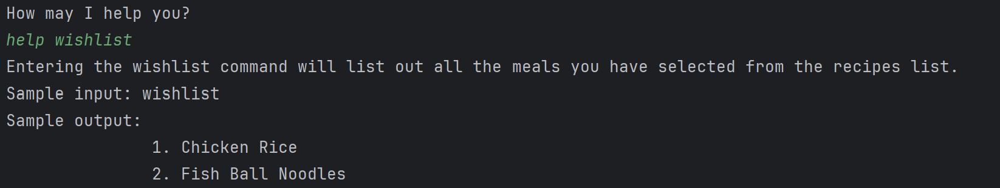

* The list of `COMMAND_KEYWORD` includes `bye`,`clear`,`create`,`delete`,`filter`,`help`,`recipes`,`remove`,`select`,`view` and `wishlist`.

### Creating a new meal: `create`
Creates a new meal with the relevant ingredients and adds the meal into the recipes list.

Syntax:
```
    create /mname MEAL_NAME /ing INGREDIENT_1_NAME (INGREDIENT_1_COST), INGREDIENT_2_NAME (INGREDIENT_2_COST)
```  
Example code:
```
    create /mname A_test_Meal /ing A(1.5), B(1.5)
```
Sample Output

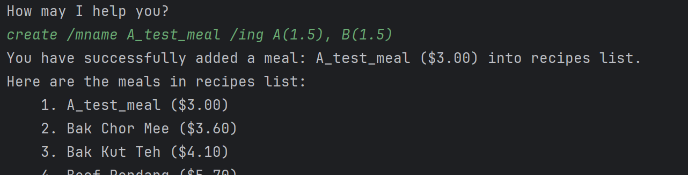

* The ingredient cost such as `INGREDIENT_1_COST` must be enclosed within `()` and parsable into a `double`.
* The order of the ingredients does not matter e.g.

   `/ing INGREDIENT_2_NAME (INGREDIENT_2_COST), INGREDIENT_1_NAME (INGREDIENT_1_COST)`.
* To create a meal that contains more than 1 ingredient, `,` is needed to separate each ingredient.
* Specifications of creating a meal:
  1. **The price of every ingredient must not be negative.**
  2. **Each meal should not have multiple ingredients with the same ingredient name.**
  3. **Duplicate meals are not allowed.**
     * Meals that contain the <ins>exact same set of ingredients</ins> (ignoring both ingredient and meal prices) should
     have <ins>different meal names</ins>.
     * Meals that contain <ins>different sets of ingredients</ins> (ignoring both ingredient and meal prices) can have
     the <ins>same meal name</ins> (optional).
     * To check for any existing meal before creating a new meal: you may use the `recipes` or `filter /mname` command to 
     find meals having the _same meal name that you intend to use_, followed by the `view` or `filter /ing` command to 
     check for _the list of ingredients in the meal(s) having the same meal name_ or _identify the meals having the same 
     set of ingredients._

Example of Usage:

Let A, B and C be ingredients. Let Meal_No. be meal name.

`create /mname Meal_1 /ing A(1.5), B(1.5)`

**Allowed** subsequent `create` commands:

`create /mname Meal_1 /ing A(2)`

`create /mname Meal_1 /ing A(2), C(1)`

`create /mname Meal_2 /ing B(1), A(1.5)` **ETC.**


**Invalid** subsequent `create` commands:

`create /mname Meal_1 /ing A(1.5), B(1.5)`

`create /mname Meal_1 /ing B(1), A(2)`

### Exiting the Application: `bye`

The bye command terminates the application gracefully. 
It prints a goodbye message to indicate that the session is closing.

Syntax:
```
    bye
```  
Example code:
```
    bye
```
Sample output:

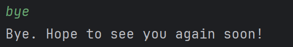

### Listing the Recipes Lists: `recipes`

The command prints the list of the recipes that is in the recipes list.

Syntax:
```
    recipes
```
Example code:
```
    recipes
```
Sample output:

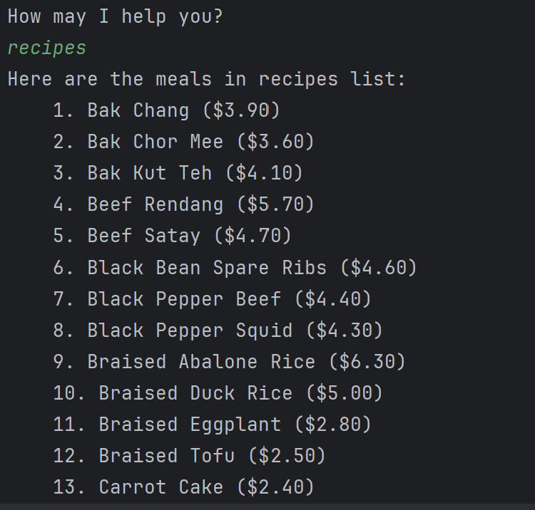

### Listing the Lists of food that the users selected: `wishlist`

The command prints the list of selected meals by the user.

Syntax:
```
    wishlist
```
Example code:
```
    wishlist
```
Sample output:

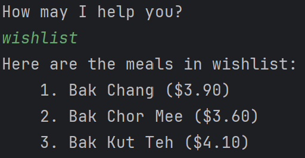

### Listing the Lists of ingredients that the users haves: `inventory`

The command prints the list of selected meals by the user.

Syntax:
```
    inventory
```
Example code:
```
    inventory
```
Sample output:

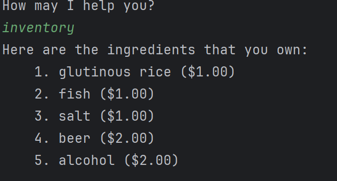

### Add ingredients into the inventory: `buy`

This command allows user to add ingredients into the inventory list

Syntax:
```
    buy /ing INGRIDIENT_NAME (INGRIDIENT_PRICE)
```
Example code:
```
    buy /ing Chicken(1),fish(1)
```
Sample output:

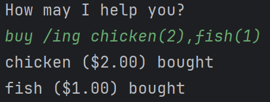

### Remove ingredients from the inventory: `consume`

This command allows user to remove ingredients from the inventory list

Syntax:
```
    consume /ing INGRIDIENT_NAME
```
Example code:
```
    consume /ing fish
```
Sample output:

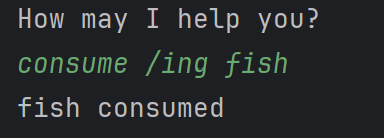

### Clear all selected meal from wishlist: `clear`

This command allows user to remove all the recipes from their own list

Syntax:
```
    clear
```
Example code:
```
    clear
```
Sample output:

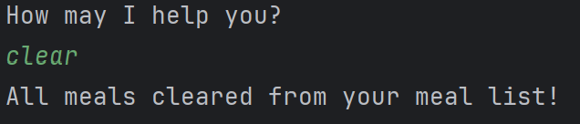

### selects a meal from recipe list and add it wishlist: `select`

This command allows user to select a recipe from the preloaded list and add it to their own list

Syntax:
```
    select
```
Example code:
```
    select INDEX_NUMBER
```
Sample output:

### Filter the recipes list via cost, ingredients or the recipe name: `filter`

This command allows user to select a recipe from the preloaded list and add it to their own list

Syntax:
```
    filter /mcost COST
    filter /ing INGREDIENT_ONE, INGREDIENT_TWO
    filter /mname RECIPE_NAME
```
Example code:
```
    filter /mcost 5.50
    filter /ing Chicken
    filter /mname Chicken Rice
```
Sample output:

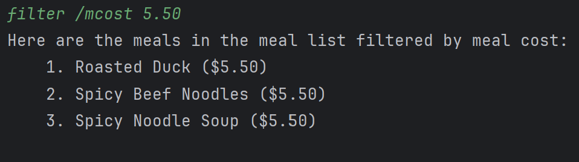

### view ingredients from the preloaded recipes list or selected recipes list: `view`

This command allows user to view the ingredients of a recipes from the preloaded recipes list or the recipe list that the user selected.

Syntax:
```
    view /r INDEX_NUMBER
    view /w INDEX_NUMBER
```
Example code:
```
    view /r 1
```
Sample output:

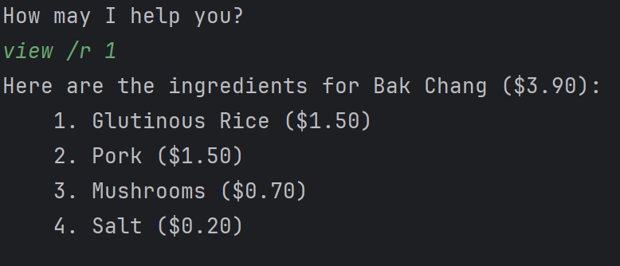

### Delete a recipe from the preloaded recipes list: `delete`

This command allows user to view the ingredients of a recipes from the preloaded recipes list or the recipe list that the user selected.

Syntax:
```
    delete INDEX_NUMBER
```
Example code:
```
    delete 87
```
Sample output:

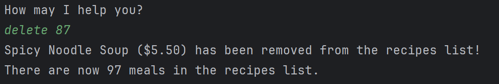

* If the user is going to delete a recipe in the recipes list and the recipe is also inside the wishlist than it will delete form both the recipes list and the wishlist as it do not make sense for the recipes list to not have and the wishlist still haves it

### Remove a recipe from the user recipes list that the user selected: `remove`

This command allows user to delete the wishlist.

Syntax:
```
    remove INDEX_NUMBER
```
Example code:
```
    remove 2
```
Sample output:

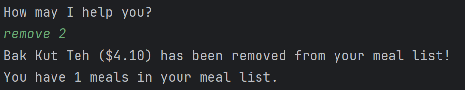

### Recommend the user a recipes with an ingredient that the user desires: `recommend`

This will recommend the user a recipe that contains the ingredient in the wish list if the wish list do not have anything containing it than it will recommend a recipe from the recipes list

Syntax:
```
    recommend
```
Example code:
```
    recommend /ing Minced Pork
```
Sample output:


## Command Summary

* Filter recipes `filter /mcost COST` or `filter /ing INGREDIENT1, INGREDIENT2` or `filter /mname NAME`
* Select recipe `select INDEX` or `select INDEX /FILTER_METHOD FILTER_INPUT`
* Remove from wishlist `remove INDEX`
* Create recipe `create /mname MEAL_NAME /ing INGREDIENT1 (COST1), INGREDIENT2 (COST2)`
* Delete recipe `delete INDEX`
* View recipe details `view /m INDEX` or `view /u INDEX`
* Get recommendations `recommend /ing INGREDIENT_NAME`
* Clear wishlist `clear`
* Get help `help COMMAND_NAME`
* Exit program `bye`
