# User Guide

## Introduction

EZMealPlan is a CLI-based system that helps users to plan their meals. Users can view a list of pre-created meals in the main
recipes list, filter them by meal name, ingredients and cost according to their personal preferences, and add them 
into their personal wishlist. Users can also create their own meals which will be added into the recipes list and remove meals from their personal wishlist and the main recipes list.
Users can also manage their own fridge inventory with the inventory list checking what are the missing ingredients for their meals.

## Quick Start

1. Ensure that you have Java `17` or above installed in your Computer.
**Mac users**: Ensure you have the precise JDK version prescribed [here](https://se-education.org/guides/tutorials/javaInstallationMac.html).
2. Download the latest version of `ezmealplan.jar` file from [here](https://github.com/AY2425S2-CS2113-F14-4/tp/releases).
3. Copy the file to the folder you want to use as the _home folder_ for your EZMealPlan.
4. Open a command terminal, `cd` into the folder you put the jar file in, and use the `java -jar ezmealplan.jar` command
to run the application. The app will contain some preset meals.
5. Type the command in the command box and press <kbd>Enter</kbd> to execute it. e.g. typing `wishlist` and pressing 
<kbd>Enter</kbd> will open the wishlist window. Some example commands you can try:

`recipes` : Lists all meals from the recipes list.

`create /mname meal test /ing ingA(1.00), ingB(2.00), ingC(3.00)` : Creates a meal called `meal test` with the following 
ingredients with their respective costs: `ingA ($1.00), ingB ($2.00) and ingC ($3.00)`

`remove 3` : Removes the 3rd meal shown in the user's wishlist.

`clear` : Deletes all meals in the user's wishlist.

`bye` : Saves the meals in the recipes list and the wishlist respectively and exits the app.

Refer to the [Features](https://ay2425s2-cs2113-f14-4.github.io/tp/UserGuide.html#features) below for details of each
command.


## 📋 Lists you will manage

In EZMealPlan, there are three main lists you will interact with:

### 🍽 Recipes List

This is the primary list where all the meals are stored. It comes pre-populated with 100 meals, but you can also add 
new meals with the `create` command. 

The meal(s) will be <ins>sorted alphabetically by their names irrespective of the letter casings followed by their prices if the meal names are identical</ins> in the recipes list. The ingredient(s) in each meal will <ins>**ONLY** be sorted alphabetically</ins> by their names irrespective of the letter casings.

Relevant commands:
- Add a meal: `create`
- View recipes list: `recipes`
- View a filtered recipes list: `filter`
- Delete a meal: `delete`

### ⭐ Wishlist

This is a secondary list where you can add and remove your favourite meals. By using the `select` command, you can select a meal from the recipes list and add it to your wishlist. The app can look through this 
list to `recommend` you certain meals for you to prepare.

The meal(s) will be <ins>sorted alphabetically by their names irrespective of the letter casings followed by their prices if the meal names are identical</ins> in the wishlist. The ingredient(s) in each meal will <ins>**ONLY** be sorted alphabetically</ins> by their names irrespective of the letter casings.

**Note:** Any meals in the wishlist that are not found in the recipes list will be deemed **illegal** and be <ins>removed from the wishlist</ins>. Before adding the respective meals into the wishlist, those meals **must be present in the recipes list**. The same meal cannot be added more than once into the wishlist.

Relevant commands:
- Add a meal to wishlist: `select`
- View wishlist: `wishlist`
- Recommend a meal: `recommend`
- Remove a meal from wishlist: `remove`

### 🧾 Inventory List
This inventory list is where you can view the ingredients that you currently own at home, helping you to know what meals you can prepare. It can contain multiple ingredients with the same name and price.

The ingredient(s) will be <ins>sorted alphabetically by their names irrespective of the letter casings followed by their prices if their names are identical</ins> in the inventory list.

Relevant commands:
- Add an ingredient to inventory: `buy`
- View inventory: `inventory`
- Consume an ingredient from inventory: `consume`

The specific features and syntax are elaborated below.

## Features 

[!NOTE]
Notes about the command format:

* Words in `UPPER_CASE` are the parameters to be supplied by the user.
E.g. in `filter /mname MEAL_NAME`, `MEAL_NAME` is a parameter, which can be used as in `filter /mname roti 
prata`.

* Items in square brackets are optional.
e.g. `select 1 [/mcost 3]` can be used as `select 1 /mcost 3` or as `select 1`.

* Extraneous parameters for commands that do not take in parameters (such as `wishlist`, `recipes`, `bye` and `clear`) will be ignored.
e.g. if the command specifies `bye 123`, it will be interpreted as `bye`.

* The command inputs are **case-insensitive**. 

* Whitespaces around the commas and **exterior** part of parentheses for the ingredient cost (provided that the order of the parentheses is correct): &larr; `()` &rarr;, as well as trailing whitespaces, are ignored, but spaces in meal and ingredient names are preserved.

* Please **do not** include whitespaces:
  1. within the command keywords
  2. within keywords with `/`
  3. within the **interior part** of the parentheses for the ingredient cost (provided that the order of the parentheses is correct): `(`&rarr; &larr;`)`
  4. within the input cost for `/mcost` filter method and the input ingredient cost enclosed within the parentheses.

### Viewing help: `help`

This command prints the description, respective sample input(s) and sample output(s) of a command that 
the user has doubts with.

Syntax:
```
    help COMMAND_KEYWORDS
```  
Example code:
```
    help wishlist
```
Sample Output

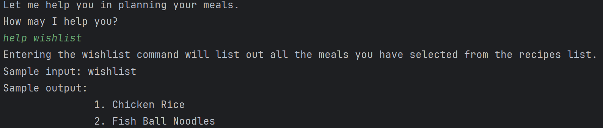

* The list of `COMMAND_KEYWORD` includes [bye](https://ay2425s2-cs2113-f14-4.github.io/tp/UserGuide.html#exiting-the-application-bye), [buy](https://ay2425s2-cs2113-f14-4.github.io/tp/UserGuide.html#adding-ingredients-into-the-inventory-buy), [clear](https://ay2425s2-cs2113-f14-4.github.io/tp/UserGuide.html#clearing-all-meals-from-the-wishlist-clear), [consume](https://ay2425s2-cs2113-f14-4.github.io/tp/UserGuide.html#removing-ingredients-from-the-inventory-consume), [create](https://ay2425s2-cs2113-f14-4.github.io/tp/UserGuide.html#creating-a-new-meal-create), [delete](https://ay2425s2-cs2113-f14-4.github.io/tp/UserGuide.html#deleting-a-meal-from-the-recipes-list-delete), [filter](https://ay2425s2-cs2113-f14-4.github.io/tp/UserGuide.html#filtering-the-recipes-list-filter), [help](https://ay2425s2-cs2113-f14-4.github.io/tp/UserGuide.html#viewing-help-help), [inventory](https://ay2425s2-cs2113-f14-4.github.io/tp/UserGuide.html#displaying-the-inventory-inventory), [recipes](https://ay2425s2-cs2113-f14-4.github.io/tp/UserGuide.html#displaying-the-recipes-list-recipes), [recommend](https://ay2425s2-cs2113-f14-4.github.io/tp/UserGuide.html#recommending-a-meal-recommend), [remove](https://ay2425s2-cs2113-f14-4.github.io/tp/UserGuide.html#removing-a-meal-from-the-recipes-list-remove), [select](https://ay2425s2-cs2113-f14-4.github.io/tp/UserGuide.html#adding-a-meal-into-to-the-wishlist-select),
[view](https://ay2425s2-cs2113-f14-4.github.io/tp/UserGuide.html#viewing-details-about-a-meal-view) and [wishlist](https://ay2425s2-cs2113-f14-4.github.io/tp/UserGuide.html#displaying-the-wishlist-wishlist).

### Creating a new meal: `create`

This command creates a new meal with the relevant ingredients and adds the meal into the recipes list.

Syntax:
```
    create /mname MEAL_NAME /ing INGREDIENT_1_NAME(INGREDIENT_1_COST)[, INGREDIENT_2_NAME(INGREDIENT_2_COST), ...]
```  
Example code:
```
    create /mname A_test_Meal /ing A(1.50), B(1.50)
```
Sample Output
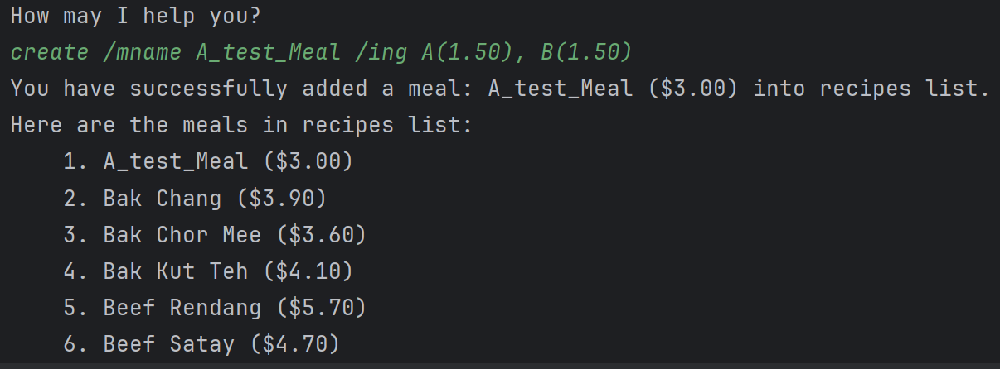

* The ingredient cost such as `INGREDIENT_1_COST` must be enclosed within `()`, at least 1 digit must be present before the `.` (example: 0.05 instead of .05) and parsable into a `double`.
* The order of the ingredients does not matter. For example, the following code has the same effect:

```
create /mname A_test_Meal /ing B(1.50), A(1.50)
```

* To create a meal that contains more than 1 ingredient, `,` is needed to separate each ingredient.

* Specifications of creating a meal:
  1. The input price for the ingredients **MUST BE IN 2 DECIMAL PLACES**. Example: `0.00`, `1.00`, `0.50`, `10.05` 
  2. The price of every ingredient/meal can only **range from `0.00` to `9999999999999.99` (both inclusive) for accuracy purpose**. 
  3. Each meal must **have at least 1 ingredient**.
  4. **Each meal should not have multiple ingredients with the same ingredient name.**
  5. **Duplicate meals are not allowed.** 
     * Meals that contain the <ins>exact same set of ingredients</ins> (ignoring both ingredient and meal prices) <ins>should
     have different meal names</ins>.
     * Meals that contain <ins>different sets of ingredients</ins> (ignoring both ingredient and meal prices) <ins>may have
     the same meal name</ins>.
     * To check for any existing meal before creating a new meal: you may use the `recipes` or `filter /mname` command to 
     find meals having the _same meal name that you intend to use_, followed by the `view` or `filter /ing` command to 
     check for _the list of ingredients in the meal(s) having the same meal name_ or _identify the meals having the same 
     set of ingredients._

Example of Usage:

Let A, B and C be ingredients. Let Meal_No. be meal name.

`create /mname Meal_1 /ing A(1.50), B(1.50)`

**Allowed** subsequent `create` commands:

`create /mname Meal_1 /ing A(2.00)`

`create /mname Meal_1 /ing A(2.00), C(1.00)`

`create /mname Meal_2 /ing B(1.00), A(1.50)` **ETC.**


**Invalid** subsequent `create` commands:

`create /mname Meal_1 /ing A(1.50), B(1.50)`

`create /mname Meal_1 /ing B(1.00), A(2.00)`

### Displaying the Recipes List: `recipes`

This command prints the list of meals that is in the recipes list (i.e. the global list of meals).

Syntax:
```
    recipes
```
Example code:
```
    recipes
```
Sample output:

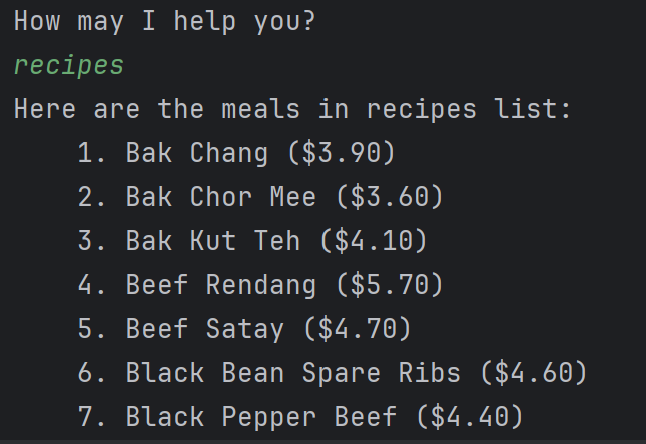

### Filtering the Recipes List: `filter`

This command allows the user to filter the Recipes List. The filter conditions can be either the meal's name, ingredients, or total cost. This is chosen via the `/mname`, `/ing` or `/mcost` tags. 
* To filter with more than 1 ingredient using `/ing`, `,` is needed to separate each ingredient. 
* The input price for the meal cost `/mcost` **MUST BE IN 2 DECIMAL PLACES** and can only **range from `0.00` to `9999999999999.99` (both inclusive) for accuracy purpose**. Example: `0.00`, `1.00`, `0.50`, `10.05`


**Take Note:**
The filter conditions for the meal's name/ingredient(s) find the meals with the respective meal's name/ingredient(s) that **CONTAINS ALL user input(s)** regardless of:
1. the casing (<ins>for</ins> `/mname` <ins>and</ins> `/ing` <ins>filtering methods</ins>)
2. the number of duplicate inputs (<ins>for</ins> `/ing` <ins>filtering method only</ins>)
3. the input sequence (<ins>for</ins> `/ing` <ins>filtering method only</ins>).
4. whether the input(s) matches exactly to the meal name or ingredient name(s)

Example:
```filter /mname burger``` &rarr; outputs all meals with meal names that have the word `burger` such as `hamburger`, `deluxe BuRGer`, `mini-burger` etc.  

```filter /ing chicken, chicken``` &rarr; outputs all meals that have the word `chicken` appearing in at least 1 of the ingredients 

```filter /ing chicken, b``` &rarr; outputs all meals which have the words `chicken` **and** `b` <ins>appearing **at least ONCE** in the same or different ingredients</ins> regardless of the ingredients input sequence and casing.

Examples:
* Meals that contain `chicken breast` with/without other ingredient(s) that have/does not have `chicken` and `b` in their names.
* Meals that contain `ChicKEN`, `pork rIBs` with/without other ingredients that have/does not have `chicken` and `b` in their names.
* Meals that contain `BIGMcChicken` with/without other ingredients that have/does not have `chicken` and `b` in their names.
* ETC. 

General Syntax:
```
    filter /mcost MEAL_COST
    filter /ing INGREDIENT_1_NAME[, INGREDIENT_2_NAME, ...]
    filter /mname MEAL_NAME
```
Example code:
```
    filter /mcost 5.50
    filter /ing Chicken
    filter /mname Chicken Rice
```
Sample output:

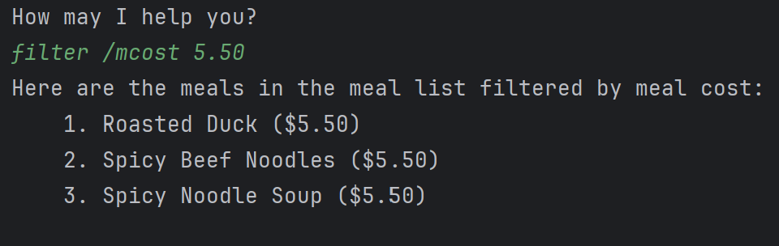

### Deleting a meal from the Recipes List: `delete`

This command allows the user to delete a meal from the Recipes List.

Syntax:
```
    delete INDEX_NUMBER
```
Example code:
```
    delete 87
```
Sample output:

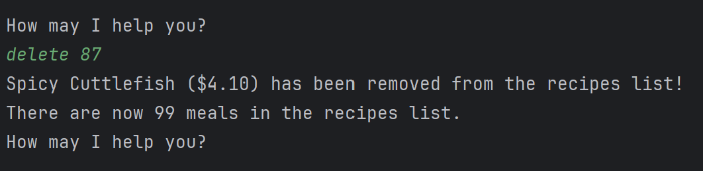

* If the user deletes a meal from the Recipes List that is also in their Wishlist, then the meal is removed from
  their Wishlist as well.

### Viewing details about a meal: `view`

This command allows the user to view the details of a meal (e.g. name, ingredients, cost breakdown) from the Recipes list (`/r`) or Wishlist (`/w`).

Syntax:
```
    view /r INDEX_NUMBER
    view /w INDEX_NUMBER
```
Example code:
```
    view /r 1
```
Sample output:

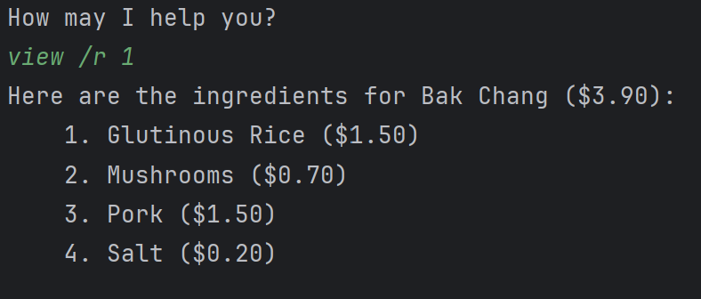

### Adding a meal into to the Wishlist: `select`

This command allows user to select a recipe from the Recipes List and add it to their Wishlist. This command has 
two modes: 
* **Normal mode**: Select by a meal's index in the Recipes List.
  * This is done using `select INDEX_NUMBER`
* **Filtered mode**: Select by a meal's index as it appears in a filtered section of the Recipes List.
  * This is done by inserting the filter condition tag (`/mname`, `/ing`, or `/mcost`), e.g. `select INDEX_NUMBER 
    /ing INGREDIENT_1_NAME[, INGREDIENT_2_NAME, ...]`.
  * To filter with more than 1 ingredient using `/ing`, `,` is needed to separate each ingredient.
  * The input price for the meal cost `/mcost` **MUST BE IN 2 DECIMAL PLACES** and can only **range from `0.00` to `9999999999999.99` (both inclusive) for accuracy purpose**. Example: `0.00`, `1.00`, `0.50`, `10.05`
  * For example, `select 1 /ing Chicken` means to filter out all the meals with at least 1 ingredient that has the word `Chicken` regardless of the casing from the Recipes List, and then selecting the first meal from the filtered list.

The filtered mode has the same user input format conditions as the `filter` command simply by replacing `filter` with `select INDEX_NUMBER`. Refer to the **Take Note** section of the [filter](https://ay2425s2-cs2113-f14-4.github.io/tp/UserGuide.html#filtering-the-recipes-list-filter) command for more information.

Syntax:
```
    select INDEX_NUMBER
    select INDEX_NUMBER /mname MEAL_NAME
    select INDEX_NUMBER /ing INGREDIENT_1_NAME[, INGREDIENT_2_NAME, ...]
    select INDEX_NUMBER /mcost MEAL_COST
```
Example code:
```
    select 20
    select 1 /ing Chicken
```
Sample output:

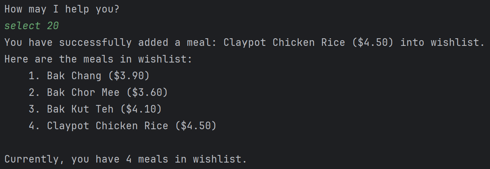

* To view the filter section before selecting, use the `filter` command with the same filtering conditions.

### Displaying the Wishlist: `wishlist`

This command prints the list of meals in the wishlist (i.e. the list of the user's favourite meals).

Syntax:
```
    wishlist
```
Example code:
```
    wishlist
```
Sample output:

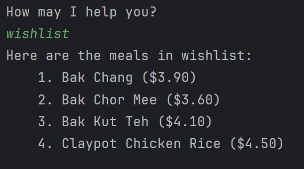

### Removing a meal from the Wishlist: `remove`

This command allows user to remove a recipe from their Wishlist.

Syntax:
```
    remove INDEX_NUMBER
```
Example code:
```
    remove 2
```
Sample output:

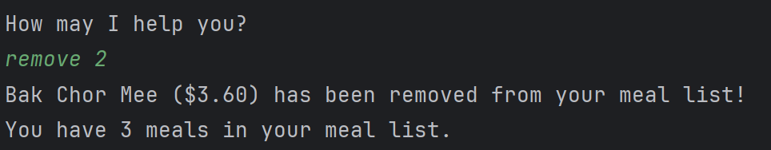

### Clearing all meals from the Wishlist: `clear`

This command allows the user to remove all the meals from the wishlist.

Syntax:
```
    clear
```
Example code:
```
    clear
```
Sample output:

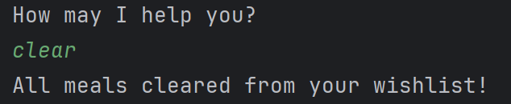

### Adding ingredients into the Inventory: `buy`

This command allows the user to add ingredients into the inventory.
* The ingredient cost such as `INGREDIENT_1_COST` must be enclosed within `()`, at least 1 digit must be present before the `.` (example: 0.05 instead of .05) and parsable into a `double`.
* To buy more than 1 ingredient, `,` is needed to separate each ingredient.
  The input price for the ingredients **MUST BE IN 2 DECIMAL PLACES**. Example: `0.00`, `1.00`, `0.50`, `10.05`
* The price of every ingredient can only **range from `0.00` to `9999999999999.99` (both inclusive) for accuracy purpose**. 
* Multiple ingredients are allowed to have the same name and price.

Syntax:
```
    buy /ing INGREDIENT_1_NAME(INGREDIENT_1_PRICE)[, INGREDIENT_2_NAME(INGREDIENT_2_PRICE), ...]
```
Example code:
```
    buy /ing Chicken(1.00), fish(1.00)
```
Sample output:

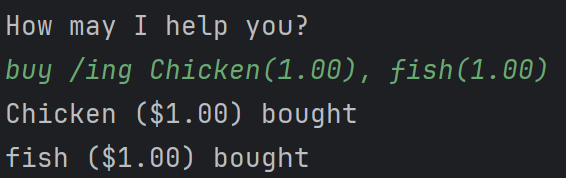

### Displaying the Inventory: `inventory`

This command prints the list of ingredients currently in the user's inventory (i.e. ingredients in the user's fridge 
or kitchen)

Syntax:
```
    inventory
```
Example code:
```
    inventory
```
Sample output:

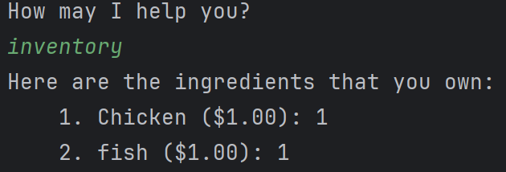

### Removing ingredients from the Inventory: `consume`

This command allows the user to remove ingredients from the inventory.
* To consume more than 1 ingredient, `,` is needed to separate each ingredient. 

   Syntax:
```
    consume /ing INGREDIENT_1_NAME[, INGREDIENT_2_NAME, ...]
```
Example code:
```
    consume /ing fish
```
Sample output:

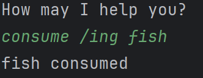

### Recommending a meal: `recommend`

This command recommends the user with a meal containing the specified ingredient, for the user to prepare. It will 
also display the missing ingredients that need to be bought.

This command looks through the Wishlist to recommend a meal; if no meals are found, then it will recommend a meal 
from the Recipes List

Syntax:
```
    recommend /ing INGREDIENT
```
Example code:
```
    recommend /ing Minced Pork
```
Sample output:

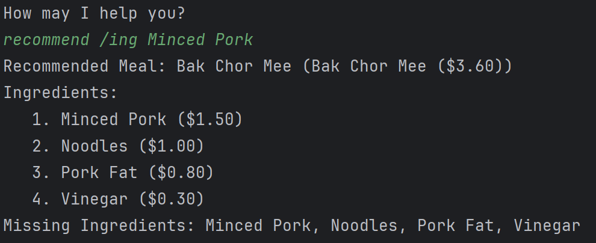

### Exiting the application: `bye`

This command saves the contents of the three lists on to disk and terminates the application gracefully.
It prints a goodbye message to indicate that the session is closing.

Syntax:
```
    bye
```  
Example code:
```
    bye
```
Sample output:

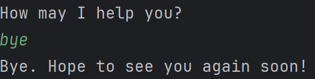


## Command Summary

* Get help `help COMMAND_NAME`
* Create meal: `create /mname MEAL_NAME /ing INGREDIENT1(COST1)[, INGREDIENT2(COST2), ...]`
* View Recipe List: `recipes`
* Filter Recipes List: `filter /mcost MEAL_COST` or `filter /ing INGREDIENT1[, INGREDIENT2, ...]` or `filter /mname 
MEAL_NAME`
* Delete meal: `delete INDEX`
* View meal details: `view /r INDEX` or `view /w INDEX`
* Select meal into Wishlist: `select INDEX` or `select INDEX /FILTER_METHOD FILTER_INPUT`
* View Wishlist: `wishlist`
* Remove from Wishlist: `remove INDEX`
* Clear Wishlist: `clear`
* Buy ingredient: `buy /ing INGREDIENT_1_NAME(INGREDIENT_1_COST)[, INGREDIENT_2_NAME(INGREDIENT_2_COST), ...]`
* View Inventory: `inventory`
* Consume ingredient: `consume /ing INGREDIENT_1_NAME[, INGREDIENT_2_NAME, ...]`
* Get recommendation: `recommend /ing INGREDIENT_NAME`
* Exit program `bye`
